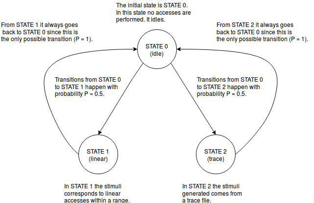

## gem5 Tips & Tricks
### **Warming up with gem5**

Here you'll find some gem5 basics just to warmup. Remember, though, to take a look at [**gem5's website**](http://www.gem5.org/Main_Page).

You can also watch these awesome video tutorials: [**Learning gem5 HPCA tutorial**](https://www.youtube.com/watch?v=5UT41VsGTsg).

### **Compiling gem5**

```bash
scons build/<arch>/gem5.<binary> -j<jobs>
```

Where:

* **\<arch\>**: architecture e.g., **ALPHA**, **ARM**, **X86**, **RISCV**. For more options, try the command below inside gem5's root directory:

```bash
ls build_opts/
```

* **\<binary\>**:
	* gem5.**debug** - A binary used for debugging without any optimizations. *_Fast compilation + slow execution_*.
	* gem5.**opt** - A binary with debugging and optimization. _*Faster execution + slower compilation*_.
	* gem5.**prof** - Same as opt target + profiling support suitable for use with gprof.
	* gem5.**perf** - Similar to prof, this target is aimed for CPU and heap profiling using the google perftools.
	* gem5.**fast** - _*Fastest execution + Debug removed*_.

* **\<jobs\>**: number of jobs to run simultaneously. If you're not sure, try the command below to get a reasonable number:

```bash
cat /proc/cpuinfo | grep processor | wc -l
```


#### Running gem5
**Modes**

* **Full System Simulation (FS)**: Model execution of both user-level and kernel-level intructions as well as complete system internal behaviors including OS and devices.

* **System Call Emulation (SE)**: Model external system calls, passing those to the host operating system. No modeling of devices and OS.

#### Running pre-provided Full-System Simulation config script

Export the environment variable **M5_PATH** poiting to full system files (disk images & binaries). Put your disk images in a folder named **disks** and the binaries in folder named **binaries**.

```bash
export M5_PATH=$M5_PATH:/path/to/full_system_files_directory:/path/to/other_full_system_files_directory
```

Prepare running script **\*.rcS** (optional)

If you want some commands to be executed by the shell after system boot then prepare a script as follows:

```bash
#!/bin/sh
# Script for running the blackscholes benchmark
cd /parsec/install/bin
/sbin/m5 dumpresetstats
./blackscholes 64 /parsec/install/inputs/blackscholes/in_64K.txt /parsec/install/inputs/blackscholes/prices.txt
echo "Finally done! :D"
/sbin/m5 exit
```

Run:

```bash
build/<arch>/gem5.<binary> config/example/fs.py --kernel=<kernel_file> --disk-image=<disk_image.img> --script=</path/to/script.rcS>
```

**NOTE**:

If you get errors stating that some files cannot be found check at least *config/common/FSConfig.py* or *config/common/Benchmarks.py* for hardcoded values.

Connect to gem5 via telnet (3456 is the port indicated in the console output):

```bash
telnet localhost 3456
```

**Using Traffic generators in gem5**:

Gem5 provides a traffic generator class that is very useful for generating accesses for read and write during memory testing.

[TrafficGen class reference](http://www.gem5.org/docs/html/classTrafficGen.html#_details) at gem5's website. 

The TrafficGen class takes a cfg file as input which contains information about the stimuli that would be created by the traffic generator.

The syntax of the cfg file is as shown below

```bash
# CFG file for traffic generator class
STATE 0 100 IDLE
STATE 1 100000 LINEAR 100 2147483648 2181038080 64 5000 5000 0
STATE 2 1000000 TRACE trace_file.trc 100
INIT 0
TRANSITION 0 1 0.5
TRANSITION 0 2 0.5
TRANSITION 1 0 1
TRANSITION 2 0 1
```

The equivalent FSM diagram is presented below:




The file format contains [STATE]+ [INIT] [TRANSITION]+ in any order, where the states are the nodes in the graph, init describes what state to start in, and transition describes the edges of the graph.

The usage is as described below:

**STATE**

```bash
STATE <id> <duration(in ticks)> <type>
```

\<id> is the ID of the state which is a number in the range [0,1,..n]

<duration (in ticks)> is the number of ticks for which the state is active before it moves to the next state in the transition.

\<type> could be IDLE, LINEAR, RANDOM or TRACE.

The IDLE state does not take any other parameters and only defines the idle state of the system.

The LINEAR and RANDOM states are described by additional parameters which control the stimuli:

```bash
STATE <id> <duration(in ticks)> <type= [LINEAR,RANDOM]> <percent_reads> <start_addr> <end_addr> <access_size(bytes)> <min_period (ticks)> <max_period (ticks)> <data_limit (bytes)>
```

\<percent_reads> is the percentage of reads in the accesses generated by the Traffic generator.

\<start_addr> and \<end_addr> are the start and end addresses of the memory that needs to be accessed by the Traffic generator. Note that the addresses are to be provided in decimal format.

\<access_size> describes the width of the data bus.

\<min_period> and \<max_period> describe the frequency of the accesses. If they are the same, then the frequency is constant. If they describe a range, the rate varies within the range.

The TRACE state takes a trace file for playback as a parameter as shown.

**INIT**

```bash
INIT <id>
```
\<id> is the ID of the init state.


**TRANSITION**

```bash
TRANSITION <id1> <id2> <transition_probability>
```

\<id1> and \<id2> are the state IDs.

The transition_probability describes the probability of the transition from state \<id1> to state \<id2>. As obvious, the sum of the transition probabilities from state \<id1> to all other possible states has to be equal to 1.
